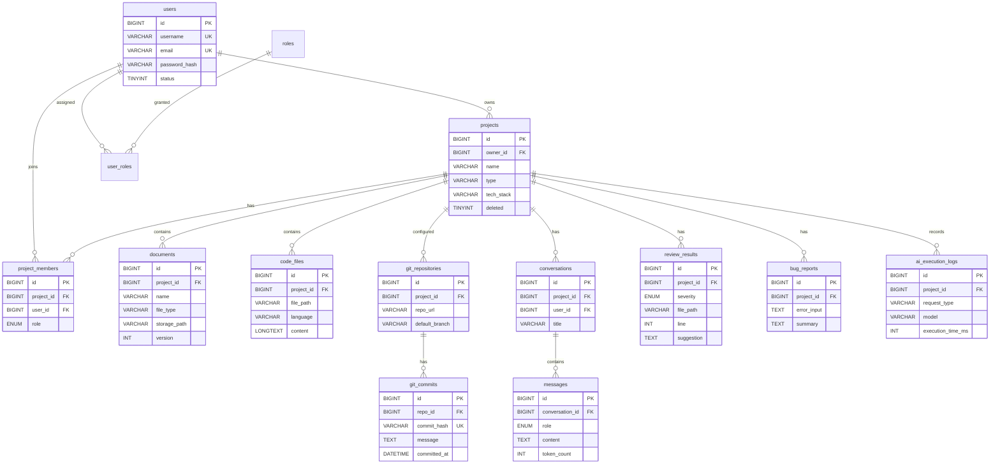

# 数据库设计说明书

**版本：** V1.0
**数据库：** MySQL 8.0
**字符集：** `utf8mb4` / `utf8mb4_unicode_ci`

---

## 1. 设计原则

1. **逻辑外键，物理不建外键约束**：关联关系在应用层与 Service 层保证，避免联表删除带来的性能与迁移问题。
2. **统一审计字段**：所有业务表均包含 `created_at`、`updated_at`。
3. **软删除优先**：文档、代码、项目等核心资产使用 `deleted` 标记，避免误删导致知识库向量与业务数据不一致。
4. **大字段分离**：代码正文、日志正文等 `TEXT` 字段不参与索引。
5. **业务主键**：统一使用 `BIGINT` 自增主键。

---

## 2. ER 图



---

## 3. 表清单

| 序号 | 表名 | 说明 |
|---|---|---|
| 1 | `users` | 用户 |
| 2 | `roles` | 系统角色 |
| 3 | `user_roles` | 用户-角色关联 |
| 4 | `projects` | 项目 |
| 5 | `project_members` | 项目成员与项目内角色 |
| 6 | `documents` | 项目文档 |
| 7 | `code_files` | 源代码文件 |
| 8 | `git_repositories` | Git 仓库配置 |
| 9 | `git_commits` | Git 提交记录 |
| 10 | `conversations` | AI 会话 |
| 11 | `messages` | 会话消息 |
| 12 | `review_results` | Code Review 结果 |
| 13 | `bug_reports` | Bug 分析报告 |
| 14 | `ai_execution_logs` | AI 执行日志 |

---

## 4. 表结构详细设计

### 4.1 users（用户）

| 字段 | 类型 | 约束 | 说明 |
|---|---|---|---|
| id | BIGINT | PK, AUTO_INCREMENT | 主键 |
| username | VARCHAR(50) | NOT NULL, UNIQUE | 用户名 |
| email | VARCHAR(100) | NOT NULL, UNIQUE | 邮箱 |
| password_hash | VARCHAR(255) | NOT NULL | BCrypt 加密，禁止明文 |
| display_name | VARCHAR(50) | | 显示名称 |
| avatar_url | VARCHAR(255) | | 头像 |
| status | TINYINT | NOT NULL, DEFAULT 1 | 0=禁用，1=正常 |
| last_login_at | DATETIME | | 最后登录时间 |
| created_at | DATETIME | NOT NULL | 创建时间 |
| updated_at | DATETIME | NOT NULL | 更新时间 |

**索引：** `UNIQUE(username)`、`UNIQUE(email)`

---

### 4.2 roles / user_roles（系统角色）

`roles`：

| 字段 | 类型 | 说明 |
|---|---|---|
| id | BIGINT PK | 主键 |
| name | VARCHAR(32) UNIQUE | `ROLE_USER` / `ROLE_ADMIN` |
| description | VARCHAR(100) | 角色说明 |

`user_roles`：

| 字段 | 类型 | 说明 |
|---|---|---|
| user_id | BIGINT | 联合主键，关联 users |
| role_id | BIGINT | 联合主键，关联 roles |

> 此处为**平台级**角色；项目内的 `OWNER / ADMIN / MEMBER / VIEWER` 见 `project_members.role`。

---

### 4.3 projects（项目）

| 字段 | 类型 | 约束 | 说明 |
|---|---|---|---|
| id | BIGINT | PK | 主键 |
| owner_id | BIGINT | NOT NULL | 创建者，关联 users |
| name | VARCHAR(100) | NOT NULL | 项目名称 |
| description | TEXT | | 项目简介 |
| project_type | VARCHAR(50) | | 项目类型（Web / CLI / Library） |
| tech_stack | VARCHAR(500) | | 技术栈，逗号分隔或 JSON |
| status | TINYINT | DEFAULT 1 | 0=归档，1=正常 |
| deleted | TINYINT | DEFAULT 0 | 软删除标记 |
| created_at | DATETIME | | |
| updated_at | DATETIME | | |

**索引：** `idx_owner_id(owner_id)`、`idx_deleted(deleted)`

---

### 4.4 project_members（项目成员）

| 字段 | 类型 | 约束 | 说明 |
|---|---|---|---|
| id | BIGINT | PK | 主键 |
| project_id | BIGINT | NOT NULL | 关联 projects |
| user_id | BIGINT | NOT NULL | 关联 users |
| role | ENUM | NOT NULL | `OWNER`/`ADMIN`/`MEMBER`/`VIEWER` |
| joined_at | DATETIME | | 加入时间 |

**索引：** `UNIQUE(project_id, user_id)`、`idx_user_id(user_id)`

**权限矩阵：**

| 能力 | OWNER | ADMIN | MEMBER | VIEWER |
|---|:---:|:---:|:---:|:---:|
| 查看项目 | ✅ | ✅ | ✅ | ✅ |
| 上传文档/代码 | ✅ | ✅ | ✅ | ❌ |
| 创建分析任务 | ✅ | ✅ | ✅ | ❌ |
| 管理成员 | ✅ | ✅ | ❌ | ❌ |
| 修改项目配置 | ✅ | ✅ | ❌ | ❌ |
| 删除项目 | ✅ | ❌ | ❌ | ❌ |

---

### 4.5 documents（文档）

| 字段 | 类型 | 约束 | 说明 |
|---|---|---|---|
| id | BIGINT | PK | 主键 |
| project_id | BIGINT | NOT NULL | 关联 projects |
| name | VARCHAR(255) | NOT NULL | 文件名称 |
| file_type | VARCHAR(20) | NOT NULL | `md`/`txt`/`pdf` |
| file_size | BIGINT | | 字节大小 |
| storage_path | VARCHAR(500) | NOT NULL | 存储路径，如 `/uploads/{projectId}/{fileId}` |
| version | INT | DEFAULT 1 | 文档版本 |
| uploaded_by | BIGINT | | 上传用户 |
| indexed | TINYINT | DEFAULT 0 | 是否已进入向量库 |
| deleted | TINYINT | DEFAULT 0 | 软删除 |
| created_at | DATETIME | | |
| updated_at | DATETIME | | |

**索引：** `idx_project_id(project_id)`、`idx_indexed(indexed)`

> `indexed` 用于知识库增量构建：未索引的文档会被切分、Embedding 后写入 Qdrant。

---

### 4.6 code_files（源代码）

| 字段 | 类型 | 约束 | 说明 |
|---|---|---|---|
| id | BIGINT | PK | 主键 |
| project_id | BIGINT | NOT NULL | 关联 projects |
| file_path | VARCHAR(500) | NOT NULL | 相对路径 |
| file_name | VARCHAR(255) | NOT NULL | 文件名 |
| language | VARCHAR(20) | | `JAVA`/`CPP`/`PYTHON`/`JAVASCRIPT`/`TYPESCRIPT` |
| content | LONGTEXT | | 文件内容 |
| file_size | BIGINT | | 字节大小 |
| commit_hash | VARCHAR(64) | | 关联提交（若来自 Git） |
| version | INT | DEFAULT 1 | 文件版本 |
| indexed | TINYINT | DEFAULT 0 | 是否已进入向量库 |
| created_at | DATETIME | | |
| updated_at | DATETIME | | |

**索引：** `UNIQUE(project_id, file_path)`、`idx_language(language)`、`idx_indexed(indexed)`

---

### 4.7 git_repositories（Git 仓库）

| 字段 | 类型 | 说明 |
|---|---|---|
| id | BIGINT PK | 主键 |
| project_id | BIGINT | 关联 projects |
| repo_url | VARCHAR(500) | 仓库地址 |
| provider | VARCHAR(20) | `GITHUB`/`GITLAB`/`GITEE` |
| default_branch | VARCHAR(100) | 默认分支 |
| access_token_ref | VARCHAR(255) | 凭证引用（不存明文 Token） |
| last_synced_at | DATETIME | 最后同步时间 |
| sync_status | VARCHAR(20) | `IDLE`/`SYNCING`/`FAILED` |

---

### 4.8 git_commits（提交记录）

| 字段 | 类型 | 说明 |
|---|---|---|
| id | BIGINT PK | 主键 |
| repo_id | BIGINT | 关联 git_repositories |
| commit_hash | VARCHAR(64) UNIQUE | 提交哈希 |
| message | TEXT | 提交信息 |
| author_name | VARCHAR(100) | 作者 |
| author_email | VARCHAR(100) | 作者邮箱 |
| committed_at | DATETIME | 提交时间 |
| additions | INT | 新增行数 |
| deletions | INT | 删除行数 |
| diff_content | LONGTEXT | Diff 内容（用于 AI 分析） |
| analyzed | TINYINT | 是否已生成 AI 摘要 |

**索引：** `idx_repo_id(repo_id)`、`idx_committed_at(committed_at)`

---

### 4.9 conversations / messages（AI 会话）

`conversations`：

| 字段 | 类型 | 说明 |
|---|---|---|
| id | BIGINT PK | 主键 |
| project_id | BIGINT | 关联 projects |
| user_id | BIGINT | 关联 users |
| title | VARCHAR(255) | 会话标题 |
| created_at / updated_at | DATETIME | |

`messages`：

| 字段 | 类型 | 说明 |
|---|---|---|
| id | BIGINT PK | 主键 |
| conversation_id | BIGINT | 关联 conversations |
| role | ENUM | `USER`/`ASSISTANT`/`SYSTEM` |
| content | TEXT | 消息内容 |
| model | VARCHAR(50) | 使用的模型 |
| token_count | INT | Token 用量 |
| citations | JSON | 引用来源（文件/路径/Commit） |
| created_at | DATETIME | |

**索引：** `idx_conversation_id(conversation_id)`

---

### 4.10 review_results（Code Review 结果）

| 字段 | 类型 | 说明 |
|---|---|---|
| id | BIGINT PK | 主键 |
| project_id | BIGINT | 关联 projects |
| user_id | BIGINT | 提交人 |
| source_type | ENUM | `FILE`/`SNIPPET`/`COMMIT`/`DIFF` |
| source_ref | VARCHAR(500) | 来源标识（文件路径 / Commit Hash） |
| severity | ENUM | `INFO`/`MINOR`/`MAJOR`/`CRITICAL` |
| category | VARCHAR(50) | `CORRECTNESS`/`PERFORMANCE`/`SECURITY`/`MAINTAINABILITY` |
| file_path | VARCHAR(500) | 问题文件 |
| line | INT | 行号 |
| description | TEXT | 问题说明 |
| risk | TEXT | 风险 |
| suggestion | TEXT | 修改建议 |
| model | VARCHAR(50) | 分析模型 |
| created_at | DATETIME | |

**索引：** `idx_project_id(project_id)`、`idx_severity(severity)`

> 结构化存储是硬性要求：前端需要按严重等级、文件、类别展示，而不是渲染一大段 AI 文本。

---

### 4.11 bug_reports（Bug 分析）

| 字段 | 类型 | 说明 |
|---|---|---|
| id | BIGINT PK | 主键 |
| project_id | BIGINT | 关联 projects |
| user_id | BIGINT | 提交人 |
| error_input | LONGTEXT | 原始错误日志 / Stack Trace |
| summary | TEXT | 错误摘要 |
| possible_causes | JSON | 可能原因列表 |
| related_files | JSON | 相关文件 |
| call_chain | TEXT | 调用链 |
| suggestions | TEXT | 修复建议 |
| test_plan | TEXT | 建议测试方案 |
| model | VARCHAR(50) | |
| created_at | DATETIME | |

---

### 4.12 ai_execution_logs（AI 执行日志）

| 字段 | 类型 | 说明 |
|---|---|---|
| id | BIGINT PK | 主键 |
| project_id | BIGINT | 关联 projects |
| user_id | BIGINT | 关联 users |
| request_type | VARCHAR(50) | `CHAT`/`REVIEW`/`BUG_ANALYSIS`/`AGENT` |
| model | VARCHAR(50) | 模型名称 |
| tools_used | JSON | 调用的工具及参数 |
| retrieved_content | JSON | 检索到的上下文摘要 |
| prompt_tokens | INT | 输入 Token |
| completion_tokens | INT | 输出 Token |
| execution_time_ms | INT | 执行耗时 |
| success | TINYINT | 是否成功 |
| error_message | TEXT | 失败原因 |
| result | LONGTEXT | 最终结果 |
| created_at | DATETIME | |

**索引：** `idx_project_id(project_id)`、`idx_created_at(created_at)`、`idx_request_type(request_type)`

---

## 5. 关键设计说明

### 5.1 双库职责划分

```text
MySQL  → 结构化业务数据（用户、项目、文件元数据、分析结果）
Qdrant → 知识库向量数据（Chunk 向量 + 元数据）
```

向量库中的 `metadata` 需回指 MySQL 主键：

```json
{
  "project_id": 12,
  "source_type": "CODE",
  "source_id": 345,
  "file_path": "src/main/java/UserService.java",
  "chunk_index": 3
}
```

这样检索到向量后，能立刻定位到 MySQL 中的原始记录，实现"回答附带来源"。

### 5.2 软删除与向量库一致性

删除文档或代码时，必须同步删除 Qdrant 中对应的向量，否则会出现"能检索到已删除内容"的问题。删除流程：

```text
标记 deleted = 1
   ↓
删除 Qdrant 中 source_id 对应的向量
   ↓
记录操作日志
```

### 5.3 权限校验落点

所有涉及 `project_id` 的查询，必须在 Service 层校验当前用户是否为该项目成员：

```text
请求 → Controller 参数校验
     → Service 校验 project_id + user_id 的 membership
     → 通过后才访问数据
```

> 严禁仅凭 URL 中的 `projectId` 直接查询——这是本项目安全测试的重点项（见 `development.md` Phase 11）。

---

## 6. 命名规范

| 对象 | 规范 | 示例 |
|---|---|---|
| 表名 | 小写复数，下划线分隔 | `project_members` |
| 字段名 | 小写下划线 | `created_at` |
| 主键 | `id` | |
| 外键 | `{表名单数}_id` | `project_id` |
| 时间字段 | `xxx_at`，DATETIME | `committed_at` |
| 布尔/标记 | TINYINT，或 `is_xxx` | `deleted`、`indexed` |
| 索引 | `idx_{字段}` | `idx_project_id` |
| 唯一索引 | `uk_{字段}` | `uk_username` |
